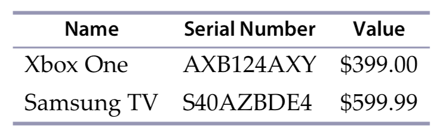

# Coding Test
#### Generated for [sandeepamilineni](https://github.com/sandeepamilineni) on Wed Nov 27 2019 at 09:51:54 GMT+0000 (Greenwich Mean Time)

Hi sandeepamilineni!

We would like you to complete the following  coding exercise - we anticipate this taking you no more than 45 minutes. You can use any programming language you like. Ideally your solution will include unit tests, preferably written using a [test-driven development](https://en.wikipedia.org/wiki/Test-driven_development) approach. The code related to your solution should be placed in a subfolder and be easy to execute - ideally **clone** &rarr; **install** &rarr; **run**.

Please commit your code back to this repository frequently. This is a time-boxed test and our assessment of your solution will be based upon the last commit you make before 09:51:54 GMT+0000 (Greenwich Mean Time) on Thu Nov 28 2019.

> Note: If you do not understand the requirements for the exercise please provide a README.md explaining the issue in place of your solution.

Good Luck!

---

Exercise #1 (45 minutes)

---
## Tracking Inventory

Write a program that tracks your personal inventory. The program should allow you to enter an item, a serial number, and estimated value. The program should then be able to print out a tabular report in both HTML and CSV formats that looks like this:

### Contraints

* Store the data in a persistent local data file in JSON, XML, or YAML format.
* Require numeric data for the value of each item.

---